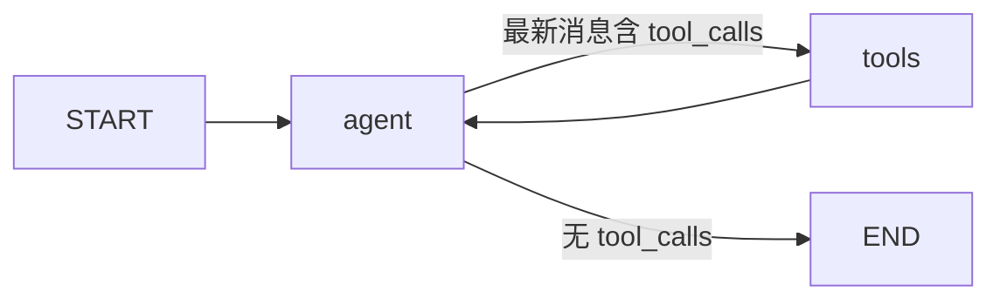
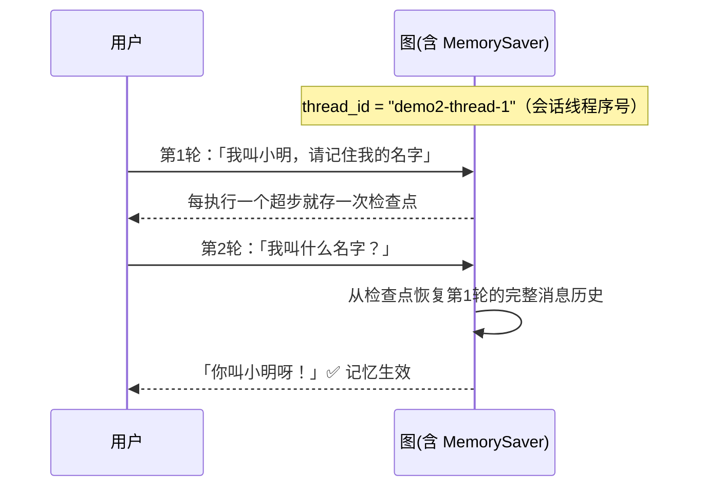
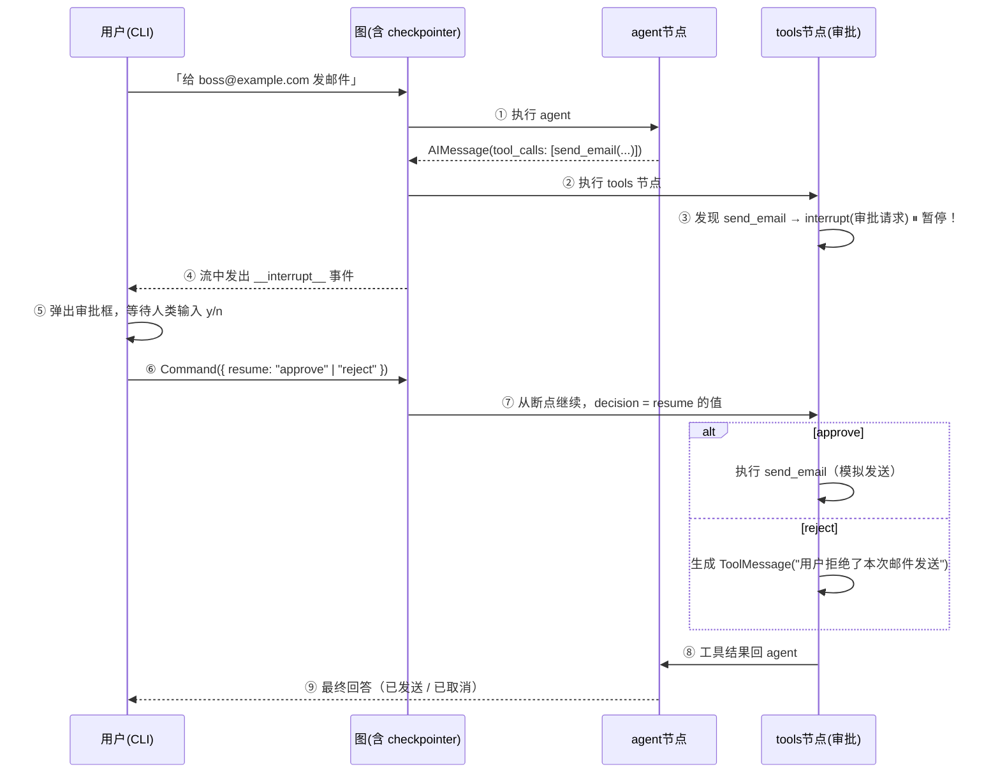
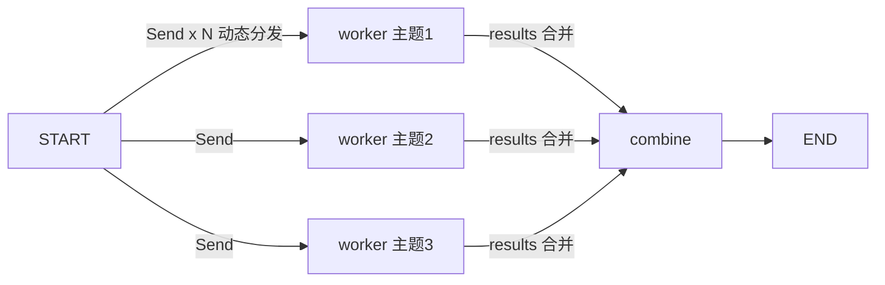

# 🤖 LangGraph.js Agent 搭建学习 Wiki

> 基于 `D:\code\agent` demo 项目编写。目标：读完这份文档，你能看懂任何 LangGraph.js 项目，
> 并能从零搭出自己的 Agent。
>
> 配套阅读：代码里每个文件都有详细中文注释，建议「文档 + 源码 + 运行观察」三者对照学习。

***

## 目录

1. [一分钟总览](#1-一分钟总览)
2. [核心概念（配代码实例）](#2-核心概念配代码实例)
3. [模块功能详解](#3-模块功能详解)
4. [调用链分析（5 个 Demo 的完整执行流程）](#4-调用链分析5-个-demo-的完整执行流程)
5. [使用方法](#5-使用方法)
6. [从 Demo 到自己搭建 Agent](#6-从-demo-到自己搭建-agent)
7. [常见坑与排查](#7-常见坑与排查)
8. [概念速查表](#8-概念速查表)

***

## 1. 一分钟总览

### 1.1 这是什么

一个用 **LangGraph.js（v1.4.9）+ TypeScript + CLI** 搭建的 Agent 学习项目。
5 个 Demo 由浅入深，覆盖 Agent 开发的全部核心概念：

| Demo | 文件                    | 概念                               | 一句话说明             |
| ---- | --------------------- | -------------------------------- | ----------------- |
| 1    | `src/agent/basic.ts`  | State / Node / Edge / 条件边 / 工具循环 | 亲手搭一张最基础的 ReAct 图 |
| 2    | `src/agent/memory.ts` | Checkpointer / thread\_id        | 给同一张图加上多轮记忆       |
| 3    | `src/agent/hitl.ts`   | interrupt / Command.resume       | 高风险操作（发邮件）执行前人工审批 |
| 4    | `src/agent/multi.ts`  | 子图 / Supervisor 路由               | 多个 Agent 组成团队协作   |
| 5    | `src/agent/parallel.ts` | Send / 自定义 State / reducer    | 并行 map-reduce：动态分发、汇聚结果 |

### 1.2 项目结构

```
D:\code\agent\
├── .env / .env.example   # 网关配置（baseURL / API_KEY / MODEL），.env 已 gitignore
├── package.json          # npm scripts：demo:1~5 / models / start / typecheck
├── tsconfig.json         # ES2022 / NodeNext / strict
├── README.md             # 快速开始
├── docs/agent-wiki.md    # 本文件
├── scripts/
│   └── list-models.ts    # npm run models：查询网关支持的模型列表
└── src/
    ├── config.ts         # 统一读取 .env 配置
    ├── llm.ts            # 模型工厂：任意 OpenAI 兼容网关的接入点
    ├── tools.ts          # 4 个自定义工具（zod 定义参数）
    ├── agent/            # 5 个 demo 的图定义（学习的重点）
    └── cli.ts            # 统一入口：交互菜单 + token 流式 + 节点日志 + 审批交互
```

### 1.3 运行方式（3 秒上手）

```bash
npm run demo:1        # 运行 Demo 1（带默认示例问题）
npx tsx src/cli.ts 1 "你的自定义问题"   # 带自定义问题
npx tsx src/cli.ts 5 "咖啡, 露营, 极光" # Demo 5 自定义主题列表
npm start             # 弹出菜单选择 Demo
```

***

## 2. 核心概念（配代码实例）

> 这是整个 wiki 最重要的一节。LangGraph 的全部概念只有 8 个，用「搭积木」理解：
> **状态**是数据，**节点**是处理步骤，**边**是连接，**工具**是模型的手脚，
> **检查点**是记忆，**interrupt** 是刹车，**子图**是乐高积木，**Send** 是并行分叉。

### 2.1 State（状态）—— 节点之间传递的数据

**一句话**：图每次执行时，在各个节点之间传递的一个数据对象。节点只能返回「对状态的修改」，由 reducer 合并进状态。

```ts
// src/agent/basic.ts
import { MessagesAnnotation } from "@langchain/langgraph";

async function agentNode(state: typeof MessagesAnnotation.State) {
  const response = await model.invoke(state.messages); // 读取当前状态
  return { messages: [response] };                      // 返回状态修改
}
```

- 这里用的是官方预置的 `MessagesAnnotation`：里面只有 `messages` 一个字段（消息列表）。
- 返回 `{ messages: [response] }` 不是「覆盖」，而是「追加」——因为 `messages` 自带追加型 reducer。
- 自定义状态用 `Annotation` 声明，例如：`{ steps: Annotation<number> }`、`{ notes: Annotation<string>({ reducer: (a,b)=>b }) }`。

### 2.2 Node（节点）—— 一个处理步骤

**一句话**：节点就是「输入 state，输出 state 修改」的 async 函数。模型调用、工具执行、业务逻辑都可以是节点。

```ts
async function agentNode(state) {
  return { messages: [await model.invoke(state.messages)] };  // 让模型思考
}

async function toolsNode(state) {
  // 执行模型要求的工具调用
  return { messages: toolResults };
}
```

### 2.3 Edge（边）与 Conditional Edge（条件边）

**一句话**：边决定执行顺序。普通边无条件直达；条件边是一个「看当前状态决定去哪」的函数。

```ts
graph
  .addEdge(START, "agent")                      // 静态边：从起点无条件到 agent
  .addEdge("tools", "agent")                    // 静态边：工具执行完必须回到 agent
  .addConditionalEdges("agent", toolsCondition) // 条件边：看 agent 的输出决定下一步
```

`toolsCondition` 是官方预置的路由函数，逻辑就是：

```ts
function toolsCondition(state) {
  const last = state.messages.at(-1);
  return last?.tool_calls?.length ? "tools" : END;  // 有工具调用→去执行；否则→结束
}
```

**这就是 ReAct 循环的核心**：agent 思考 → 要调工具就去 tools → 拿到结果回 agent → 再思考……直到不再调工具，直接给最终回答。

### 2.4 ToolNode 与工具（Tool）

**一句话**：工具是给模型「调用」的普通函数；`ToolNode` 是官方预置的「执行工具」节点，会把模型请求的工具挨个执行，结果转成 `ToolMessage` 追加进消息历史。

```ts
// src/tools.ts —— 用 zod 声明参数，模型才能知道怎么调用
export const calculator = tool(
  async ({ expression }) => `计算结果：${expression} = ...`,
  {
    name: "calculator",
    description: "计算数学表达式，支持 + - * / 和括号",
    schema: z.object({ expression: z.string() }),   // ← 参数 schema 是关键
  }
);

// src/agent/basic.ts —— 两个关键动作：
const model = createChatModel().bindTools(tools);   // ① 把工具「绑」到模型上
.addNode("tools", new ToolNode(tools))              // ② 用 ToolNode 执行工具
```

### 2.5 Checkpointer（检查点）—— 记忆

**一句话**：`compile({ checkpointer })` 之后，图每执行完一个超步就把状态存一份快照；同一 `thread_id` 的多次调用共享这些快照，于是 Agent「记住了」之前的对话。

```ts
// src/agent/memory.ts —— 和 basic.ts 的唯一区别：
import { MemorySaver } from "@langchain/langgraph";

const checkpointer = new MemorySaver();            // 内存版（进程退出即忘）
graph.compile({ checkpointer });

// 调用时带上 thread_id（会话线程序号）
await graph.invoke(input, { configurable: { thread_id: "demo2-thread-1" } });
await graph.invoke(input, { configurable: { thread_id: "demo2-thread-1" } }); // 同线程序号 → 有记忆
```

### 2.6 interrupt / Command —— 人工介入（刹车）

**一句话**：`interrupt()` 在节点内部「暂停」图的执行，把状态和请求原样抛给外部（如 CLI）；外部人类做出决定后，用 `Command({ resume: 决定 })` 把决定「喂」回暂停处，图从断点继续。

```ts
// src/agent/hitl.ts —— 执行高风险工具前暂停
const decision = interrupt<"approve" | "reject">({
  type: "approval",
  toolName: call.name,
  description: `向 ${call.args.to} 发送邮件...`,
});
// decision 就是外部通过 Command({ resume }) 传回的值

// 外部恢复（src/cli.ts）
await graph.invoke(new Command({ resume: decision }), { configurable: { thread_id } });
```

> ⚠️ interrupt 依赖 checkpointer 保存「暂停时的状态」，所以 HITL 必须配 checkpointer。

### 2.7 Subgraph（子图）—— 乐高积木

**一句话**：一张编译好的图可以直接当成另一个图的「节点」用。多个 Agent 各是一张子图，由主管图编排，就是多 Agent 协作。

```ts
// src/agent/multi.ts —— 每个员工是一张独立编译好的图
const researcherGraph = new StateGraph(MessagesAnnotation)
  .addNode("agent", researcherAgentNode)
  .addNode("tools", new ToolNode(researchTools))
  ...编译...

// 主管图把子图当节点注册
new StateGraph(MessagesAnnotation)
  .addNode("supervisor", supervisorNode)
  .addNode("researcher", researcherGraph)   // ← 子图就是普通节点
  ...
```

> 注意：子图与父图用同一个 `MessagesAnnotation` 时，**状态天然互通**——子图往 `messages` 里追加的内容，父图直接能看到。

### 2.8 Send（动态分发）与自定义 State / Reducer —— 并行 map-reduce

**一句话**：条件边的路由函数除了返回节点名，还可以返回 `new Send("节点", 私有输入)` 的数组——有几个元素就并行执行几个该节点实例；配合自定义 State 的 reducer（合并规则），实现 fan-out（分发）→ fan-in（汇聚）的 map-reduce 模式。

```ts
// src/agent/parallel.ts —— 自定义 State：完全不用 MessagesAnnotation！
const ParallelState = Annotation.Root({
  subjects: Annotation<string[]>({ reducer: (_o, n) => n }),      // 覆盖式
  results: Annotation<string[]>({                                  // ★ 追加式：
    reducer: (old, updated) => old.concat(updated),                //   并行 worker 各写一条，
    default: () => [],                                             //   reducer 自动合并 → fan-in
  }),
});

// worker 收到的不是整个 State，而是 Send 发来的「私有输入」{ subject }
async function workerNode(input: { subject: string }) {
  return { results: [`「${input.subject}」：${await makeSlogan(input.subject)}`] };
}

// 分发函数：返回 Send[] = 动态 fan-out（有 3 个主题就并行跑 3 个 worker）
function dispatch(state) {
  return state.subjects.map((subject) => new Send("worker", { subject }));
}

graph
  .addConditionalEdges(START, dispatch)  // START 也能接条件边做分发
  .addEdge("worker", "combine")          // 所有 worker 完成后自动进入 combine（超步屏障）
```

**关键认知**：
- reducer 是并行安全的唯一正确姿势——并行节点**永远不要直接覆盖**共享字段，只返回增量，让 reducer 合并；
- fan-in 不需要手写「等待逻辑」：LangGraph 的超步（superstep）屏障保证 combine 一定在全部 worker 完成后才执行；
- Demo 1~4 的条件边返回的是「节点名字符串」，一次只去一个地方；Send 返回的是「任务包」，同一节点可同时跑 N 份。

***

## 3. 模块功能详解

### 3.1 `src/config.ts` — 配置管理

**职责**：从 `.env` 读取网关的三件套 `BASE_URL` / `API_KEY` / `MODEL`，集中管理，全局唯一配置入口。

```ts
export const config = {
  baseURL: process.env.BASE_URL ?? "https://tokenrhythm.studio/v1",
  apiKey: process.env.API_KEY ?? "",
  model: process.env.MODEL ?? "deepseek-v4-flash",
};
export function assertConfig(): void { /* 缺 Key 时打印提示并退出 */ }
```

**为什么独立成模块**：换供应商/模型只改 `.env`，所有业务代码零改动（这是「配置与逻辑分离」的示范）。

### 3.2 `src/llm.ts` — 模型工厂

**职责**：唯一创建 Chat 模型的地方。核心一行：

```ts
new ChatOpenAI({
  model: config.model,
  apiKey: config.apiKey,
  temperature,                       // 0 = 尽量确定性输出
  maxRetries: 2,                     // 网关偶发 503，让 SDK 自动重试
  configuration: { baseURL: config.baseURL },  // ★ 接入任意 OpenAI 兼容网关
});
```

**关键点**：`ChatOpenAI` 的 `configuration.baseURL` 指向任意 OpenAI Chat Completions 兼容地址（中转站、vLLM、Ollama 的 OpenAI 兼容层都行），不需要供应商专属 SDK。

### 3.3 `src/tools.ts` — 工具库

**职责**：定义 4 个工具，示范工具的四种形态：

| 工具               | 参数                   | 形态示范                         |
| ---------------- | -------------------- | ---------------------------- |
| `calculator`     | `expression: string` | 纯函数工具（正则白名单 + Function 安全求值） |
| `getCurrentTime` | 无参数                  | 空 schema `z.object({})` 的工具  |
| `getWeather`     | `city: string`       | 模拟外部 API（真实项目换成天气服务调用）       |
| `sendEmail`      | `to/subject/body`    | 「高风险操作」，在 Demo 3 中需要审批       |

同时导出：

- `demoTools`：工具数组，方便一次性绑定；
- `toolsByName`：`name → 工具` 的映射，Demo 3 手动执行工具时按名字查找。

### 3.4 `src/agent/basic.ts` — Demo 1：亲手搭 ReAct 图

**职责**：不借助 prebuilt 的 `createReactAgent`，用最原始的 API 搭出「思考 → 工具 → 思考」循环，是理解一切的基础。

```ts
export function createBasicGraph() {
  return new StateGraph(MessagesAnnotation)
    .addNode("agent", agentNode)                    // ① 思考节点
    .addNode("tools", new ToolNode(tools))          // ② 工具节点
    .addEdge(START, "agent")                        // ③ 从哪开始
    .addConditionalEdges("agent", toolsCondition)   // ④ 要不要调工具？
    .addEdge("tools", "agent")                      // ⑤ 调完必须回来继续想
    .compile();                                     // ⑥ 编译后才能调用
}
```

### 3.5 `src/agent/memory.ts` — Demo 2：加记忆

**职责**：与 basic.ts 图结构**完全相同**，唯一区别是 `compile({ checkpointer })`。一个词：`compile` 时多传一个参数。用来对比「有/无记忆」的行为差异。

### 3.6 `src/agent/hitl.ts` — Demo 3：人工审批

**职责**：在 tools 节点里手动实现工具执行循环（顺带演示 ToolNode 的内部原理），遇到 `send_email` 就 `interrupt()` 暂停。

```ts
async function approvalToolsNode(state) {
  for (const call of lastMessage.tool_calls ?? []) {
    if (call.name === "send_email") {
      const decision = interrupt({ type: "approval", toolName, description, args }); // ★ 暂停
      // decision 来自人类：approve → 执行；reject → 生成拒绝结果
    } else {
      // 普通工具直接执行
    }
  }
}
```

对外还导出：

- `ApprovalRequest`（interrupt 载荷的类型，CLI 据此渲染审批框）；
- `buildResumeCommand(decision)` → `new Command({ resume: decision })`。

### 3.7 `src/agent/multi.ts` — Demo 4：Supervisor 团队

**职责**：主管 + 两个员工（研究员、作家），员工各是一张子图。主管用「虚拟工具」`delegate` 做决策——模型发出 `delegate(member: "researcher")` 就路由到研究员，不再分派就 END。

```ts
async function routeFromSupervisor(state) {
  const call = state.messages.at(-1)?.tool_calls?.[0];
  if (call?.name === "delegate") return call.args.member;  // 路由到对应员工
  return END;                                               // 任务完成，收工
}
```

**设计亮点**：`delegate` 工具永远不会真正执行（没有对应的 tools 节点），它的作用只是「让模型用工具调用的形式表达分派意图」，条件边拦截后直接路由。

### 3.8 `src/agent/parallel.ts` — Demo 5：并行 map-reduce

**职责**：输入一组主题，为每个主题**并行**调用一次模型生成宣传语（map），全部完成后由汇总节点整合成一段文案（reduce）。是全项目唯一**不用 MessagesAnnotation** 的图。

三个教学点：
- `Annotation.Root` 自定义 State 字段与各自的 reducer（覆盖式 / 追加式）；
- 条件边返回 `Send[]`（而非节点名）实现动态 fan-out，worker 收到的是「私有输入」；
- `addEdge("worker", "combine")` 的 fan-in 由超步屏障自动保证，无需手写等待。

另导出 `parseSubjects()`：解析用户传入的逗号分隔主题列表（默认「人工智能, 量子计算, 航天探索」，上限 6 个防滥用）。

### 3.9 `src/cli.ts` — 统一入口（怎么把图「用起来」）

**职责**：菜单选择、token 级流式输出、逐节点可视化日志、人工审批交互。对学习最重要的四个机制：

1. **双模式流式观察**（Demo 1~4）：`graph.stream(input, { streamMode: ["updates", "messages"] })` 同时订阅两种粒度——`messages` 是 token 级增量（思考过程灰色逐字显示 + 回答打字机效果），`updates` 是节点级更新（`🔧 工具请求` / `📦 工具返回`）。CLI 会跳过 updates 里的 AI 正文，避免与 token 流重复。
2. **子图回显去重**：子图完成事件会把整个消息历史回显一遍，CLI 按「消息 id 去重」只打印真正新增的消息（`collectUpdateLines`）。
3. **审批交互**：`streamGraph` 检测到 `__interrupt__` 事件就返回暂停信息，`demo3` 弹审批框，用户回答后用 `Command({ resume })` 继续。
4. **Demo 5 故意不开 token 流式**：多个并行 worker 的 token 会交错输出，用「节点完成」视角反而更能看清并行结构（这本身就是个流式并发的教学点）。

另外 `LineReader` 类处理了「管道输入（`echo ... | npm run demo:2`）」场景，EOF 时优雅退出。

### 3.10 `scripts/list-models.ts` — 查模型

**职责**：请求 `{BASE_URL}/models`，打印网关全部模型（上下文长度、是否支持工具/推理、价格），并校验 `.env` 里的 MODEL 是否在列表内。**这是排查「HTTP 400 无响应体」的第一工具**。

### 3.11 `package.json` — 命令总览

| 命令                           | 作用                            |
| ---------------------------- | ----------------------------- |
| `npm run demo:1` \~ `demo:5` | 运行对应 Demo                     |
| `npx tsx src/cli.ts N "参数"`  | 带自定义问题/主题运行（N=1\~5）           |
| `npm start`                  | 交互菜单                          |
| `npm run models`             | 查询网关模型列表                      |
| `npm run typecheck`          | TypeScript 类型检查（tsc --noEmit） |

> 用 `tsx` 直接运行 TS，不需要编译步骤；`tsconfig.json` 保持 `noEmit`，类型检查单独跑。

***

## 4. 调用链分析（5 个 Demo 的完整执行流程）

> 这一节是「学会了」的关键：把每一轮对话在图里怎么流动看明白。
> 以下时序均来自本项目实测运行日志（缩写展示）。

### 4.1 Demo 1：基础 ReAct 的调用链



**执行步骤**（输入「北京天气 + 计算 (12+7)\*3」）：

```
① START → agent 节点
     model.invoke(历史消息) → 模型决定调用工具
     → AIMessage(tool_calls: [get_weather({city:北京}), calculator({expression:"(12+7)*3"})])

② 条件边 toolsCondition 判断：有 tool_calls → 路由到 "tools"

③ tools 节点（ToolNode）逐个执行：
     get_weather  → ToolMessage("「北京」当前 26°C，晴转多云。")
     calculator   → ToolMessage("计算结果：(12+7)*3 = 57")

④ 静态边 tools → agent：带着工具结果回到 agent 再想一次

⑤ agent 节点再次 invoke：这次看到了工具结果，不再调工具
     → AIMessage(最终回答：北京天气 + 计算结果)

⑥ 条件边：无 tool_calls → END，图结束
```

**实测日志**（`npm run demo:1`）：

```
── 节点执行: agent ──
   🔧 [agent] 模型请求调用工具: get_weather({"city":"北京"}), calculator({"expression":"(12+7)*3"})
── 节点执行: tools ──
   📦 [tools] 工具返回: 「北京」当前 26°C，晴转多云。
   📦 [tools] 工具返回: 计算结果：(12+7)*3 = 57
── 节点执行: agent ──
   🤖 [agent] 两个问题都搞定了：1. 北京天气：26°C 晴转多云。2. 计算：(12+7)*3 = 57
```

**要点**：模型一次可以请求多个工具（并行）；工具结果以 `ToolMessage` 回到消息历史，agent 下一轮才能「看到结果并总结」。这就是 ReAct（Reasoning + Acting）循环。

### 4.2 Demo 2：记忆的调用链

图结构与 Demo 1 相同，区别在「多次调用之间」：



**实测日志**（`npm run demo:2`，两轮对话）：

```
第1轮  🤖 [agent] 好的，小明！我已经记住你的名字了。😊
第2轮  🤖 [agent] 你叫**小明**呀！😄
```

**要点**：LLM 本身无状态。记忆 = 每次执行完把状态（含全部消息）存下来，下次用同一 `thread_id` 时从检查点恢复。换一个 `thread_id` 就是全新会话。

### 4.3 Demo 3：人工审批的调用链



**实测日志**（批准路径，`npm run demo:3`）：

```
── 节点执行: agent ──
   🔧 [agent] 模型请求调用工具: send_email({"to":"boss@example.com","subject":"项目进度汇报",...})
⏸️  图已暂停，等待人工审批（输入 y / 是 批准，n / 否 拒绝）：
  工具: send_email
  请求: 向 boss@example.com 发送邮件，主题「项目进度汇报」
  👤 你的决定: ✅ 批准，继续执行
   🤖 最终回答: 邮件已成功发送 ✅
```

**要点**：

- `interrupt()` 的返回值 = 外部 `Command({ resume: X })` 传回的 X，这是「图内 ↔ 图外」通信的通道；
- interrupt 必须在节点内调用，且必须有 checkpointer（暂停点需要持久化）；
- 拒绝路径同样自然：把「用户拒绝了」作为工具结果消息，agent 会据此给出得体的最终回答——模型不需要知道审批的存在。

### 4.4 Demo 4：Supervisor 多 Agent 的调用链

```mermaid
flowchart LR
  START --> supervisor
  supervisor -->|delegate(member=researcher)| researcher
  supervisor -->|delegate(member=writer)| writer
  supervisor -->|"无 delegate 调用"| END
  researcher --> supervisor
  writer --> supervisor
```

**执行步骤**（任务：「查北京天气，写一首四行诗」）：

```
① supervisor 节点：主管模型绑定「虚拟工具 delegate」
     → delegate({task: "查询北京天气...", member: "researcher"})

② 条件边 routeFromSupervisor：取最新消息的 tool_calls[0]
     → 返回 "researcher" → 路由到研究员子图

③ researcher 子图（自己就是一张 ReAct 图）内部循环：
     agent → get_weather → 工具结果 → 研究总结 → 结束子图
     研究总结写进共享的 messages 状态

④ 静态边 researcher → supervisor：主管看到研究结果，继续决策
     → delegate({task: "写四行诗...", member: "writer"})

⑤ writer 子图执行：无工具的 agent 节点，直接产出诗

⑥ 静态边 writer → supervisor：主管看到诗，认为任务完成
     → 不再调用 delegate → 直接给最终汇总 → 条件边返回 END
```

**实测日志**（`npm run demo:4`，缩写）：

```
── 节点执行: supervisor ──
   🔧 [supervisor] 模型请求调用工具: delegate({task:"查询北京今天（当前）的天气...", member:"researcher"})
── 节点执行: researcher ──
   🔧 [researcher] 模型请求调用工具: get_weather({"city":"北京"})
   📦 [researcher] 工具返回: 「北京」当前 26°C，晴转多云。
   🤖 [researcher] 好的，研究员已查得北京天气信息如下：26°C，晴转多云。...
── 节点执行: writer ──
   🤖 [writer] **《北京晴转多云》** 天光淡去浮云生，暖风拂面过京城。...
✅ Demo 4 完成
```

**要点**：

- 「虚拟工具」路由是 Supervisor 模式的经典实现：不用结构化输出、不用手写分类器，模型天然会用工具调用来表达「把活派给谁」；
- 子图与父图共享 `MessagesAnnotation` → 员工的工作成果自动出现在主管视野里；
- 结束条件写在主管的系统提示里（「任务完成就直接回答，不要再调用 delegate」），条件边据此收工；
- 防死循环：LangGraph 默认有递归上限（25 个超步），超限抛 `GraphRecursionError`。

### 4.5 Demo 5：并行 map-reduce 的调用链



**执行步骤**（主题：人工智能 / 量子计算 / 航天探索）：

```
① START 的条件边调用 dispatch(state)
     → 返回 3 个 Send("worker", {subject}) → 动态创建 3 个并行任务

② 3 个 worker 实例同时执行（互不等待）
     每个 worker 只收到自己的私有输入 { subject }，调用模型写一句宣传语
     → 各自返回 { results: ["「主题」：宣传语"] }

③ 超步屏障：3 个 worker 全部完成后，reducer 把三份 results 合并成一个数组

④ combine 节点执行：此时 state.results 已是完整列表
     → 调用模型把 3 条宣传语整合成一段文案 → 写入 state.summary

⑤ END
```

**实测日志**（`npm run demo:5`）：

```
🧪 主题列表: 人工智能、量子计算、航天探索

   ⚙️  [worker] 「量子计算」：量子跃迁，算见未来
   ⚙️  [worker] 「航天探索」：摘一颗星，回应千年的仰望
   ⚙️  [worker] 「人工智能」：以人工，致智能

   📝 [combine] 汇总文案：
从「以人工，致智能」到「量子跃迁，算见未来」，再到「摘一颗星，回应千年的仰望」……

⏱️  总耗时 64.3s（3 个 worker 并行执行）
✅ Demo 5 完成
```

**要点**：
- worker 的完成顺序是乱的（量子计算先回来）——并行执行的真实面貌；
- 每个 worker 只返回增量 `{ results: [一条] }`，靠 reducer 自动合并，**绝不直接覆盖共享字段**；
- combine 不需要任何「等待/计数」逻辑——超步屏障天然保证它看到的是全部结果。


***

## 5. 使用方法

### 5.1 快速开始

```bash
cd D:\code\agent
npm install
cp .env.example .env        # 填入 BASE_URL / API_KEY / MODEL（已填好可用配置）
npm run models              # ① 先确认网关支持的模型（防 400）
npm run demo:1              # ② 跑第一个 Demo
```

### 5.2 交互方式对照

| 想做什么            | 命令                                                |
| --------------- | ------------------------------------------------- |
| 跑 Demo 1 的默认问题  | `npm run demo:1`                                  |
| 跑 Demo 1 的自定义问题 | `npx tsx src/cli.ts 1 "帮我算一下 (5+3)*2"`            |
| Demo 2 / 3 多轮对话 | `npm run demo:2` / `demo:3`（输入 exit/quit/q/退出 结束） |
| Demo 5 自定义主题    | `npx tsx src/cli.ts 5 "咖啡, 露营, 极光"`（逗号/顿号分隔，最多 6 个） |
| 管道批量输入（自动化测试）   | `printf '问题1\n问题2\nexit\n' \| npm run demo:2`     |
| 菜单模式            | `npm start`                                       |
| 查模型             | `npm run models`                                  |
| 类型检查            | `npm run typecheck`                               |

### 5.3 推荐练习问题

| Demo | 练习问题                             | 观察点                          |
| ---- | -------------------------------- | ---------------------------- |
| 1    | 「北京天气怎么样？顺便算 (12+7)\*3」          | 一次请求调用两个工具的并行行为；灰色思考里能看到模型决定并行调用 |
| 1    | 「现在几点了？」                         | 无参数工具                        |
| 1    | 「上海呢？」（不带城市名追问）                  | ⚠️ 无记忆时模型没有上下文               |
| 2    | 先「我叫小明」，再「我叫什么？」                 | 记忆生效的直观证明（思考过程会引用上一轮内容）     |
| 2    | 换 thread\_id 再问                  | 新会话无记忆                       |
| 3    | 「给 <boss@example.com> 发邮件，主题：周报」 | 分别输入 y / n，对比两条路径            |
| 3    | 先拒绝，再问「邮件发出去了吗？」                 | Agent 能理解审批结果并正确回答           |
| 4    | 「查北京天气，写一首四行诗」                   | 主管 → 研究员 → 作家 完整流转；最终思考里能看到主管判断「任务完成、不再分派」 |
| 4    | 「直接写一首关于秋天的诗」                    | 主管直接派给 writer，不经过 researcher |
| 5    | `npx tsx src/cli.ts 5 "奶茶, 吉他, 深夜"` | worker 完成顺序是乱的（并行的真实面貌）      |
| 5    | 把 parallel.ts 的主题改成 6 个再跑          | 观察耗时随并行度变化，而非成倍增长           |

### 5.4 更换供应商 / 模型

只改 `.env` 三行，业务代码零改动：

```ini
BASE_URL=https://你的网关/v1     # 任意 OpenAI Chat Completions 兼容地址
API_KEY=sk-xxx
MODEL=deepseek-v4-flash          # 必须是 npm run models 列出的 id
```

也支持本地模型：Ollama 开启 OpenAI 兼容层（`http://localhost:11434/v1`）、vLLM、LM Studio 同理。

### 5.5 观察与调试技巧

- **看模型思考**：Demo 1~4 的灰色 `💭 思考` 就是 `streamMode: "messages"` 的 `reasoning_content` 增量——你能亲眼看到模型如何决定调用哪个工具、主管何时判断任务完成；
- **看执行流程**：`🔧/📦` 日志即「每节点更新」，等于 `streamMode: "updates"` 的可视化；
- **看原始事件**：临时写 `for await (const ev of await graph.stream(input, { streamMode: ["messages","updates"] })) console.log(ev)`——v1 数组模式输出 `[模式名, 载荷]` 二元组；
- **看状态快照**：`graph.getState({ configurable: { thread_id } })` 可查看检查点里的完整状态；
- **单步调试**：`streamMode: "updates"` 下每个事件就是图的一个超步，和日志一一对应。

***

## 6. 从 Demo 到自己搭建 Agent

> 学习闭环：看懂 4 个 demo 后，按下面的「最小模板 + 扩展路线」搭你自己的 Agent。

### 6.1 最小可用模板（复制即用）

```ts
// my-agent.ts
import { StateGraph, START, END, MessagesAnnotation } from "@langchain/langgraph";
import { ToolNode, toolsCondition } from "@langchain/langgraph/prebuilt";
import { tool } from "@langchain/core/tools";
import { z } from "zod";
import { createChatModel } from "./src/llm.js";   // 复用本项目的模型工厂

// ① 定义你的工具
const myTool = tool(async ({ x }) => `翻倍结果：${x * 2}`, {
  name: "double",
  description: "把数字翻倍",
  schema: z.object({ x: z.number() }),
});

// ② 模型绑定工具
const model = createChatModel().bindTools([myTool]);

// ③ 定义节点
async function agentNode(state: typeof MessagesAnnotation.State) {
  return { messages: [await model.invoke(state.messages)] };
}

// ④ 搭图（和 Demo 1 完全一样的骨架）
export function createMyAgent() {
  return new StateGraph(MessagesAnnotation)
    .addNode("agent", agentNode)
    .addNode("tools", new ToolNode([myTool]))
    .addEdge(START, "agent")
    .addConditionalEdges("agent", toolsCondition)
    .addEdge("tools", "agent")
    .compile();
}

// ⑤ 调用
const result = await createMyAgent().invoke({
  messages: [{ role: "user", content: "把 21 翻倍" }],
});
console.log(result.messages.at(-1).content);
```

### 6.2 扩展路线（对应 5 个 demo）

| 你的需求           | 参考     | 做法                                                                        |
| -------------- | ------ | ------------------------------------------------------------------------- |
| 多轮记忆           | Demo 2 | `compile({ checkpointer: new MemorySaver() })` + 每次调用带同一 `thread_id`      |
| 高风险操作人工把关      | Demo 3 | tools 节点里对特定工具 `interrupt()`，外部 `Command({ resume })`                     |
| 复杂任务拆给多个 Agent | Demo 4 | 每个 Agent 编译成子图，主管图 `addNode` 注册 + 条件边路由                                   |
| 批量子任务并行处理      | Demo 5 | 条件边返回 `Send[]` 分发 + 自定义 State 的追加型 reducer 汇聚                              |
| 换记忆存储          | 查文档    | `SqliteSaver` / `PostgresSaver`（`@langchain/langgraph-checkpoint-*`）实现持久化 |
| 生产级快速搭建        | 查文档    | prebuilt 的 `createReactAgent`（一行搭 ReAct），原理同 Demo 1                       |

### 6.3 设计 Agent 的四步心法

1. **画流程图**：先在纸上画出「状态流转图」，标出每个节点、条件分支；
2. **定状态**：节点之间需要传递什么数据 → 设计 State 字段；
3. **写节点**：每个节点是一个独立函数，只做一件事；
4. **接边**：先接静态边跑通，再加条件边做分支，最后上 checkpointer/interrupt 增强。

***

## 7. 常见坑与排查

### 7.1 网关相关

| 现象                                 | 原因                               | 解决                                    |
| ---------------------------------- | -------------------------------- | ------------------------------------- |
| `HTTP 400` 且无响应体                   | 模型名不在网关支持列表（如 `gpt-4o-mini`）     | `npm run models` 看列表，改 `.env` 的 MODEL |
| `HTTP 503 SERVICE_BUSY`            | 网关并发过高（本项目网关很频繁）                 | 重试即可；`llm.ts` 已配 `maxRetries: 2`      |
| 输出夹杂 `<｜begin▁of▁sentence｜>` 等特殊标记 | deepseek 系模型的 tokenizer 特殊 token | 换 `glm-5` / `kimi-k2.5` 等模型           |

### 7.2 LangGraph v1 API 差异（网上 0.x 教程不适用）

- `graph.stream(input, options)` 是**两参签名**：`streamMode`、`configurable` 都合并进 options，没有第三个参数；
- 数组 streamMode（`["messages","updates"]`）输出 `[模式名, 载荷]` 二元组；单个 `"updates"` 输出 `{节点名: 更新}`；
- 检查点类叫 **`MemorySaver`**（不是 `InMemorySaver`）；prebuilt 助手是 **`createReactAgent`**（不是 `createAgent`）；
- `interrupt()` 的暂停信息出现在 updates 载荷的 **`__interrupt__`** 键里；
- 工具 schema 用 **zod v4**：`z.object({...})`；
- **updates 数组的两种含义**：普通节点更新只含该节点**新增**的消息；子图完成事件回显**完整历史**。去重只能按「消息 id」，不能用「数组位置/计数」（本项目踩过：计数游标导致 tools 节点的第一条结果被吞）；
- 开启 messages 流模式后，updates 里的消息可能是 **`AIMessageChunk`**——v1 中它与 `AIMessage` **没有继承关系**，`instanceof AIMessage` 判不出来，需要两个都判断。

### 7.3 行为类

| 现象                        | 原因与解决                                                         |
| ------------------------- | ------------------------------------------------------------- |
| Demo 4 子图完成事件回显整段历史       | 子图完成更新 = 完整状态快照。CLI 已按「消息 id 去重」处理；自己打印日志时同样处理               |
| 条件边路由不到 "tools"           | `toolsCondition` 默认找名为 `"tools"` 的节点；改名需自定义路由函数               |
| interrupt 不生效 / resume 报错 | 检查 `compile({ checkpointer })` 是否配置、resume 时 `thread_id` 是否一致 |
| 模型不调用工具                   | 检查 `bindTools` 是否执行、工具 `description` 是否清晰（模型靠描述决定何时调用）        |
| 图不结束死循环                   | 默认 25 超步递归上限，超限抛 `GraphRecursionError`；在系统提示里明确「何时收手」         |

***

## 8. 概念速查表

| 概念               | 一句话                             | Demo | 代码位置                                                |
| ---------------- | ------------------------------- | ---- | --------------------------------------------------- |
| State            | 节点间传递的数据对象                      | 全部   | `MessagesAnnotation`                                |
| Node             | 处理步骤（async 函数）                  | 全部   | `basic.ts` 的 `agentNode`                            |
| Edge             | 节点连线，决定顺序                       | 全部   | `.addEdge(...)`                                     |
| Conditional Edge | 看状态选下一步的路由函数                    | 1、4  | `.addConditionalEdges(...)` / `routeFromSupervisor` |
| Tool / ToolNode  | 模型可调用的函数 / 执行工具的内置节点            | 1、4  | `tools.ts` / `new ToolNode(...)`                    |
| ReAct 循环         | 思考→工具→思考…直到回答                   | 1    | `basic.ts` 全图                                       |
| Checkpointer     | 状态快照，图获得记忆                      | 2    | `compile({ checkpointer })`                         |
| thread\_id       | 会话线程序号，同号共享记忆                   | 2、3  | `configurable: { thread_id }`                       |
| interrupt        | 节点内暂停图，等外部决定                    | 3    | `hitl.ts`                                           |
| Command(resume)  | 把外部决定送回暂停处                      | 3    | `buildResumeCommand` / `cli.ts`                     |
| Subgraph         | 编译好的图当节点用                       | 4    | `multi.ts`                                          |
| Supervisor       | 主管 agent 用虚拟工具路由                | 4    | `multi.ts`                                          |
| Annotation.Root  | 自定义 State 字段（非消息型状态）            | 5    | `parallel.ts` `ParallelState`                       |
| Reducer          | 并行写同一字段时的合并规则（追加/覆盖）            | 5    | `reducer: (old, updated) => old.concat(updated)`    |
| Send             | 条件边返回任务包，同节点并行跑 N 份             | 5    | `new Send("worker", { subject })`                   |
| map-reduce       | fan-out 并行处理 → 超步屏障 → fan-in 汇总 | 5    | `parallel.ts` 全图                                    |
| streamMode       | 流的输出粒度（updates/messages/values） | CLI  | `cli.ts` `streamGraph`                              |

***

> 💡 **下一步建议**：按 [6.1 最小模板](#61-最小可用模板复制即用) 把 `my-agent.ts` 写出来，
> 套一个你自己的工具（比如查数据库、调公司 API），跑通后再逐步加记忆、审批、多 Agent。
> 遇到报错先看 [第 7 节](#7-常见坑与排查)——本项目的坑基本就是 Agent 开发的通用坑。

